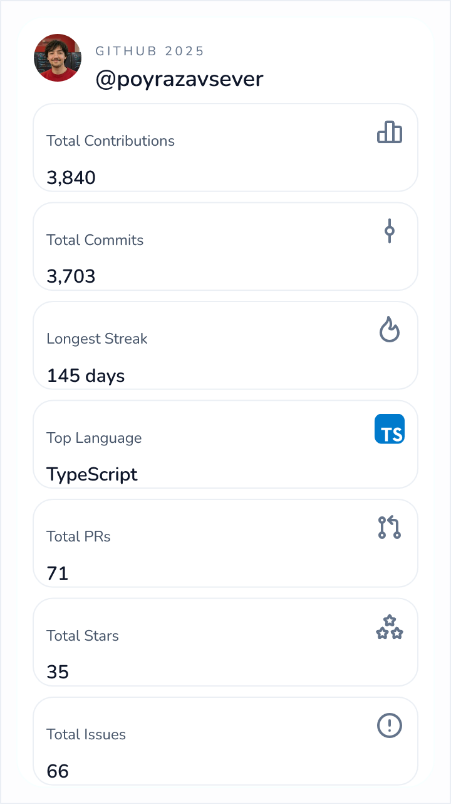

# GitHub 2025 Stats Card


Generate a shareable 2025 GitHub stats card for any username. The app fetches data from the GitHub GraphQL API, renders a clean card, and lets you download it as a PNG.



## Features
- Enter any GitHub username and fetch 2025 contribution stats.
- Shows totals for contributions, commits, PRs, issues, stars, reviews, longest streak, and top language.
- Download the card as a high-resolution PNG (uses html2canvas).
- Lightweight UI with a holiday-themed logo and responsive layout.

## Quick start
Prerequisites: Node.js 18+ and npm.

1) Install dependencies:
```bash
npm install
```
2) Create `.env.local` and set a GitHub token:
```
GITHUB_TOKEN=your_token_here
```
3) Run the dev server:
```bash
npm run dev
```
4) Open http://localhost:3000 and try a username (for example, `octocat`).

## GitHub token
- Use a fine-grained personal access token with read-only scopes for `public_repo` (and `read:user` if needed).
- Storing the token in `.env.local` avoids hitting anonymous rate limits.

## How to use the app
1) Enter a GitHub username in the input field.
2) Submit to fetch 2025 stats.
3) Review the card details.
4) Click **Download PNG** to save the rendered card image.

## API reference
- `POST /api/stats`
  - Body: `{ "username": "the-github-handle" }`
  - Returns: aggregated 2025 stats (commits, PRs, issues, reviews, stars for repos created in 2025, longest streak, top language, avatar).
  - Uses the GitHub GraphQL API under the hood.

## Tech stack
- Next.js 16 (App Router) and React 19
- Tailwind CSS 4 for styling
- html2canvas for PNG export
- Iconify for icons

## Notes
- Stats are scoped to the 2025 calendar year.
- If GitHub rate limits are hit, add or refresh your `GITHUB_TOKEN`.
